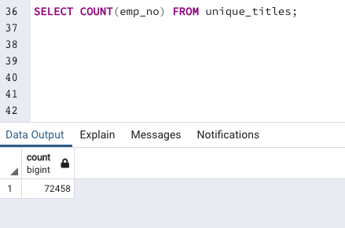
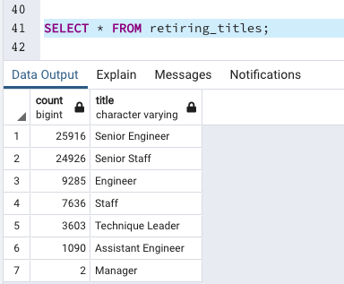
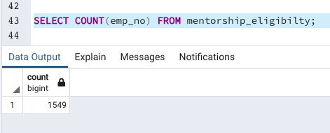
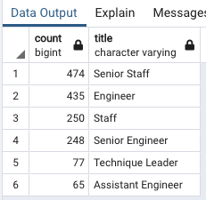

# Pewlett-Hackard-Analysis

## Overview of the analysis: Explain the purpose of this analysis.
I conducted an analysis for Pewlett Hackard's employees. With the information given to me, I was able to slice and dice the data to determine how many employees were coming up on retirement, how many in each department, etc. 

In this analysis, we specifically wanted to see the number of retiring employees per title and the employees who are eligible to participate in a mentorship program.

## Results: 
- I discovered there were 72,458 total employees that were eligible to retire:

- I also discovered the count of retiring employees by title, and how many are expected to retire per title. In this discovery, senior job positions had an overwhelming majority of employees eligible to retire.

- Before filtering out duplicate employees, there were in total 133,776 titles eligible to retire. After conducting a query to filter out duplicates and create a clean list, we discovered 61,318 duplicates. The clean list is located in unique_titles.csv.
- Finally, we found 1,549 employees eligibile for the mentorship program. 


## Summary: Provide high-level responses to the following questions, then provide two additional queries or tables that may provide more insight into the upcoming "silver tsunami."
### 1. How many roles will need to be filled as the "silver tsunami" begins to make an impact?
Like stated above, 72,458 total employees are eligible to retire and roles will need to be filled. More specifically, 25,916 Senior Engineer roles, 24,926 Senior Staff roles, 9,285 Engineer roles, 7,636 Staff roles, 3,603 Technique Leader roles, 1,090 Assistant Engineer roles, and 2 Manager roles. That information is located [here](https://github.com/alyssamaestringer/Pewlett-Hackard-Analysis/blob/main/Analysis%20Projects%20Folder/Pewlett-Hackard-Analysis%20Folder/data/retiring_titles.csv) in the analysis.

### 2. Are there enough qualified, retirement-ready employees in the departments to mentor the next generation of Pewlett Hackard employees?
In total, there are 72,458 employees ready to retire and only 1,549 employees eligible for the mentorship program. There should be plenty of retirement-ready emplpyees to mentor the next generation of Pewlett Hackard employees. 

To break down if there are enough retirement-ready employees in the departments to mentor the next gen of employees, you can create a new query to see the breakdown of eligible mentor employees by department. The query for that would look like:
```
SELECT COUNT(title), title AS "title" 
FROM mentorship_eligibilty
GROUP BY title
ORDER BY "count" DESC;
```

After running that query, we can see the following information:


With this information in mind and compared to the information we [already have](https://github.com/alyssamaestringer/Pewlett-Hackard-Analysis/blob/main/Analysis%20Projects%20Folder/Pewlett-Hackard-Analysis%20Folder/data/retiring_titles.csv) on the breakdown of retiring employees by title, we know that there are plenty of retiring employees availble to mentor the eligible next generation of Pewlett Hackard employees.
